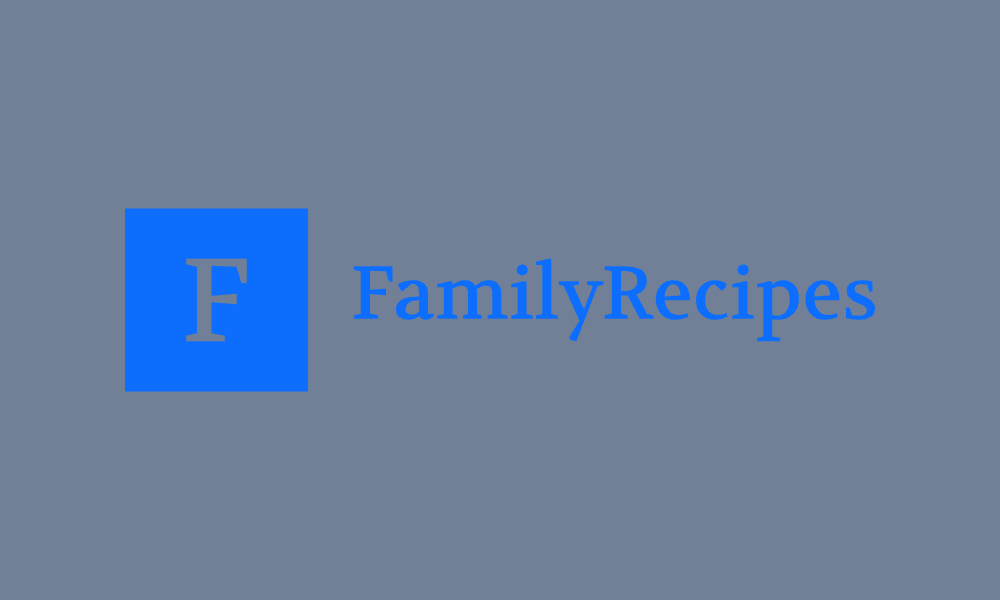

# Family Recipe App

<p align="center">
  
</p>

A Flask web application for preserving and sharing family recipes. This platform is dedicated to keeping old recipes alive and accessible while creating and sharing new ones.

## Features

- User Registration and Authentication
- Recipe Management (Create, Read, Update, Delete)
- Dynamic Ingredient Management
- Recipe Search Functionality
- Modern, Responsive UI Design
- Secure Password Management
- PWA Support with App Icons
- Family-Friendly Interface

## Tech Stack

### Backend
- Flask 3.0.0
- SQLAlchemy 2.0.23
- Flask-Login for authentication
- Flask-WTF for forms
- Flask-Migrate for database migrations
- Flask-Bcrypt for password hashing
- Gunicorn for production deployment

### Frontend
- Bootstrap 5 for responsive design
- Font Awesome for icons
- Custom CSS with modern design principles
- Progressive Web App (PWA) features
- Google Fonts (Poppins)

### Database
- SQLite for simple deployment
- Supports up to 2000+ recipes
- Optimized for family-scale usage (25+ users)

### Testing & CI/CD
- pytest for unit testing
- GitHub Actions for CI/CD pipeline
- Flake8 for code linting

## Project Structure

```
family-site/
├── app.py              # Main application file
├── config.py           # Configuration settings
├── models.py           # Database models
├── forms.py            # Form definitions
├── extensions.py       # Flask extensions
├── templates/          # Jinja2 templates
├── static/            
│   ├── css/           # Stylesheets
│   ├── js/            # JavaScript files
│   └── img/           # Images and icons
├── tests/             # Test suite
└── instance/          # Instance-specific files
```

## Installation

1. Clone the repository:
```bash
git clone https://github.com/cdobratz/family-recipe-app.git
cd family-recipe-app
```

2. Create and activate a virtual environment:
```bash
python -m venv venv
source venv/bin/activate  # On Windows use: venv\Scripts\activate
```

3. Install dependencies:
```bash
pip install -r requirements.txt
```

4. Initialize the database:
```bash
python init_db.py
```

5. Run the application:
```bash
# Development
python app.py

# Production
gunicorn -c gunicorn.conf.py app:app
```

The application will be available at `http://localhost:5001` in development mode.

## Development

### Running Tests
```bash
python -m pytest
```

### Code Style
The project uses Flake8 for code linting. Run:
```bash
flake8 .
```

### Branch Strategy
- `main`: Production-ready code
- `development`: Active development branch
- `family`: Deployment branch for family members

## Deployment

The application is designed for simple deployment on PythonAnywhere:

1. Supports SQLite database for easy management
2. Includes Gunicorn configuration
3. PWA-ready with offline capabilities
4. Optimized for family-scale usage (25+ users)
5. Built-in backup support

## Recent Updates

- Modern UI redesign with improved typography and spacing
- Added PWA support with custom icons
- Optimized database for family-scale usage
- Improved recipe management interface
- Added custom branding and logos

## Contributing

1. Fork the repository
2. Create your feature branch (`git checkout -b feature/AmazingFeature`)
3. Commit your changes (`git commit -m 'Add some AmazingFeature'`)
4. Push to the branch (`git push origin feature/AmazingFeature`)
5. Open a Pull Request

## License

This project is licensed under the MIT License - see the LICENSE file for details.
